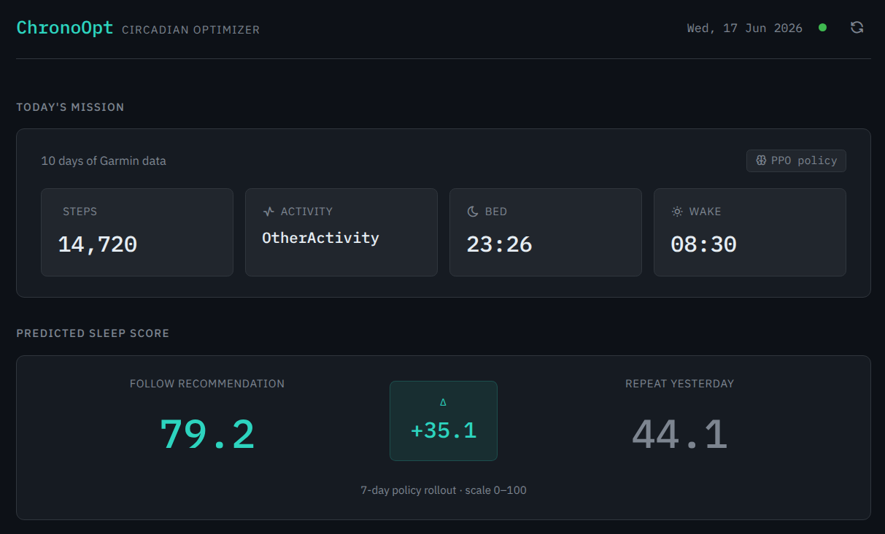
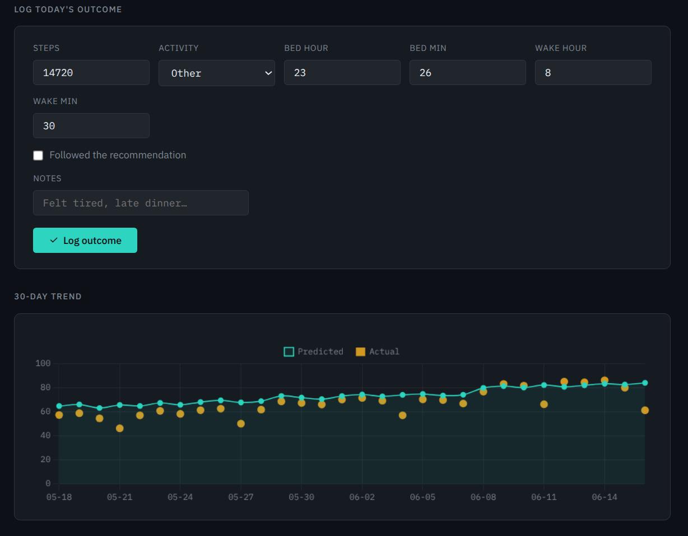
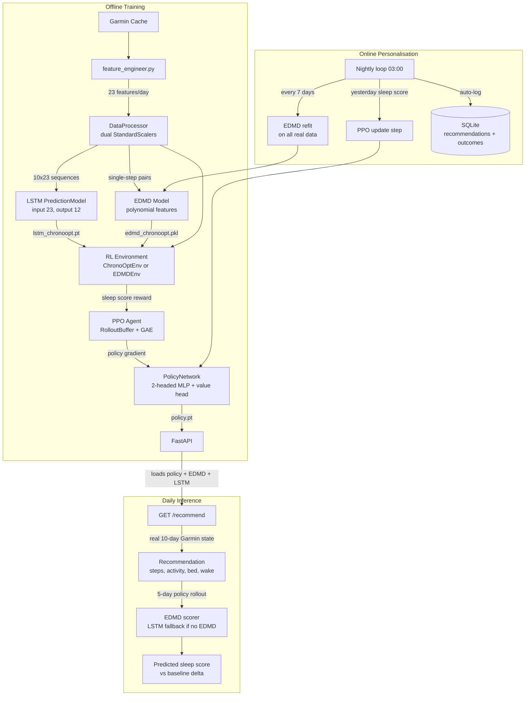

# ChronoOpt

Personal circadian rhythm optimisation system. Ingests Garmin biometric data, trains an LSTM and EDMD dynamics model to predict next-day physiological responses, and uses a PPO reinforcement learning agent to recommend daily behaviours that maximise sleep quality.

Built as a full ML pipeline from raw wearable data to a served daily recommendation, with an online personalisation loop that adapts the policy and refits the dynamics model on real user data nightly.


<div align="center">
  
</div>

## Architecture



**Inference flow:** the trained policy maps the last 10 days of real Garmin state to today's recommended action. Both the recommendation and the baseline (repeat yesterday) are scored via identical 5-day rollouts — using EDMD as the dynamics model when available, falling back to the LSTM otherwise. The delta between the two scores is the headline metric.

---

## Quick start

```bash
git clone https://github.com/lukas-kramer07/ChronoOpt
cd ChronoOpt

pip install -r requirements.txt

cp .env.example .env        # add GARMIN_EMAIL and GARMIN_PASSWORD

# Train the dynamics models
python -m src.models.train_pred_model   # LSTM
python -m src.models.train_edmd         # EDMD

# Train the PPO agent
python -m src.rl_agent.train_agent

# Serve the dashboard
uvicorn src.api.main:app --reload
# http://localhost:8000
# http://localhost:8000/docs   (interactive API)
```

---

## How it works

### 1. Dynamics models

An LSTM trained on personal Garmin data predicts the next day's 12 physiological features from a 10-day history window of 23 features per day. Used as the world model during offline RL training.

EDMD (Extended Dynamic Mode Decomposition) is fit on the same data and serves as the primary scoring model at inference time. It takes a single scaled 23-feature day vector as input rather than a sequence, making it faster and more interpretable than the LSTM. The LSTM remains the fallback when no EDMD model is loaded.

### 2. RL agent (PPO)

A two-headed policy network maps the scaled observation (10 x 23 = 230 inputs) to a continuous action (steps, bed time, wake time) and a categorical action (activity type). Trained with Proximal Policy Optimisation against `ChronoOptEnv` (LSTM) or `EDMDEnv`, where the reward is a sleep score proxy (0-100) computed from predicted sleep metrics.

`DeterministicEnv` provides an analytical world model for validating the training loop without any learned model dependency.

### 3. Scoring

At inference time, both the recommendation and the baseline are scored using identical 5-day rollouts. The recommendation rollout lets the policy re-observe and re-act at each step. EDMD is the preferred dynamics model for scoring; the LSTM is used as a fallback. The delta is the headline metric in the dashboard.

### 4. Online personalisation

A nightly APScheduler job at 3 AM fetches the previous day's real Garmin data, computes the actual sleep score, and runs a single online PPO update using that as the reward signal. The EDMD model is refit on all available real data every 7 days. Outcomes are written to SQLite automatically, so no manual logging is required. However, missing data can be added or overwritten manually.

---

## Project structure

```
ChronoOpt/
├── src/
│   ├── config.py
│   ├── data_ingestion/
│   │   ├── garmin_parser.py              Garmin API + local JSON cache
│   │   ├── check_valid_days.py           data quality audit
│   │   └── self_report_handler.py
│   ├── features/
│   │   ├── feature_engineer.py           raw metrics to 23-feature daily dict
│   │   └── utils.py                      calculate_sleep_score_proxy()
│   ├── models/
│   │   ├── data_processor.py             dual StandardScalers, flatten/reconstruct
│   │   ├── prediction_model.py           LSTM, input=23, output=12
│   │   ├── edmd_model.py                 EDMD dynamics model
│   │   ├── train_pred_model.py           LSTM training pipeline
│   │   ├── train_edmd.py                 EDMD training pipeline
│   │   └── plot_utils.py
│   └── rl_agent/
│       ├── rl_environment.py             ChronoOptEnv (LSTM world model)
│       ├── edmd_environment.py           EDMDEnv (EDMD world model)
│       ├── deterministic_environment.py  analytical env for training validation
│       ├── policy_network.py             two-headed MLP + value head
│       ├── ppo_agent.py                  RolloutBuffer + PPOAgent
│       ├── agent.py                      (deprecated REINFORCE, kept for reference)
│       └── train_agent.py               full PPO training pipeline
├── src/api/
│   ├── main.py                           FastAPI app, lifespan, APScheduler
│   ├── inference.py                      ModelBundle, EDMD/LSTM scoring
│   ├── database.py                       SQLite: recommendations, outcomes, model_log
│   ├── models.py                         Pydantic request/response types
│   ├── online_loop.py                    nightly PPO update + EDMD refit
│   └── static/index.html                 dashboard
├── notebooks/
│   ├── 01_eda_garmin_data.ipynb
│   ├── 02_feature_engineering_exploration.ipynb
│   ├── 03_prediction_model_prototyping.ipynb
│   └── 04_rl_agent_experimentation.ipynb
├── tests/
│   ├── debug_policy.py                   policy behaviour diagnostics
│   ├── env_dummy_test.py
│   ├── test_data_ingestion.py
│   ├── test_features.py
│   ├── test_models.py
│   └── test_sleep_score.py
└── data/
    └── raw_data/                         Garmin JSON cache (git-ignored)
```

---

## Feature vector

23 features per day, split into two groups:

| Group | Indices | Features |
|---|---|---|
| Agent-controlled | 0-10 | total_steps, activity flags x6, bed_hour, bed_minute, wake_hour, wake_minute |
| Model-predicted | 11-22 | avg_hr, resting_hr, respiration, stress, body_battery, total/deep/REM/awake sleep, restlessness, sleep_stress, sleep_rhr |

---

## API

Interactive docs at `http://localhost:8000/docs`.

| Endpoint | Description |
|---|---|
| `GET /health` | model load status, system check |
| `GET /recommend` | today's recommendation + predicted scores |
| `GET /recommend?refresh=true` | force re-run inference |
| `GET /history?days=30` | recommendation vs actual outcome history |
| `POST /loop/run` | manually trigger the nightly personalisation loop |

---

## Stack

| Layer | Technology |
|---|---|
| Data ingestion | `garminconnect` (unofficial API) |
| Dynamics models | PyTorch 2.x LSTM, EDMD (scikit-learn) |
| RL | PPO with GAE, two-headed policy network |
| API | FastAPI, Pydantic, APScheduler, SQLite |
| Frontend | Vanilla JS, Chart.js, IBM Plex fonts |
| Training | CUDA |

---

## Notes

Uses the unofficial `garminconnect` Python library for personal use only. May conflict with Garmin's Terms of Service. Use at your own discretion.
