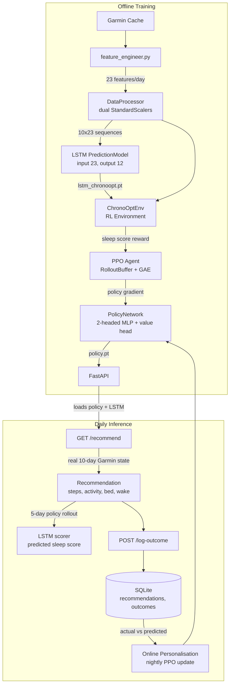

# ChronoOpt

Personal circadian rhythm optimisation system. Ingests Garmin biometric data, trains an LSTM to predict next-day physiological responses, and uses a PPO reinforcement learning agent to recommend daily behaviours that maximise sleep quality.

Built as a full ML pipeline from raw wearable data to a served daily recommendation, with an online personalisation loop that adapts to the individual user over time.


---

## Architecture



**Inference flow:** the trained policy maps the last 10 days of real Garmin state to today's recommended action. The LSTM then scores both the recommendation and the baseline (repeat yesterday) by running identical 5-day rollouts through the environment, returning the average predicted sleep score for each.

---

## Quick start

```bash
git clone https://github.com/lukas-kramer07/ChronoOpt
cd ChronoOpt

pip install -r requirements.txt

cp .env.example .env        # add GARMIN_EMAIL and GARMIN_PASSWORD

# Train the LSTM prediction model
python -m src.models.train_pred_model

# Train the PPO agent
python -m src.rl_agent.train_agent

# Serve the dashboard
uvicorn src.api.main:app --reload
# http://localhost:8000
# http://localhost:8000/docs   (interactive API)
```


---

## How it works

### 1. Prediction model (LSTM)

An LSTM trained on personal Garmin data predicts the next day's 12 physiological features (heart rate, sleep architecture, stress, body battery) from a 10-day history window of 23 features per day. Trained offline; serves as the environment's world model during RL training and as a scoring oracle at inference time.

### 2. RL agent (PPO)

A two-headed policy network maps the scaled observation (10 x 23 = 230 inputs) to a continuous action (steps, bed time, wake time) and a categorical action (activity type). Trained with Proximal Policy Optimisation on `ChronoOptEnv`, where the reward is a sleep score proxy (0-100) computed from LSTM-predicted sleep metrics.

`DeterministicEnv` provides an analytical world model for validating the training loop without LSTM dependency.

### 3. Scoring

At inference time, both the recommendation and the baseline (repeat yesterday) are scored using identical 5-day rollouts through the LSTM environment. The policy re-observes and re-acts at each step of the recommendation rollout. The delta between the two scores is the headline metric shown in the dashboard.

### 4. Online personalisation (in progress)

Each logged outcome provides a real (state, action, reward) tuple. A nightly background task runs a PPO update on this data, fine-tuning the policy toward the individual user's physiology. The offline training is the prior; daily logging is the personalisation signal.

---

## Project structure

```
ChronoOpt/
├── src/
│   ├── config.py
│   ├── data_ingestion/
│   │   └── garmin_parser.py         Garmin API + local JSON cache
│   ├── features/
│   │   ├── feature_engineer.py      raw metrics to 23-feature daily dict
│   │   └── utils.py                 calculate_sleep_score_proxy()
│   ├── models/
│   │   ├── data_processor.py        dual StandardScalers, flatten/reconstruct
│   │   ├── prediction_model.py      LSTM, input=23, output=12
│   │   └── train_pred_model.py      training pipeline
│   └── rl_agent/
│       ├── rl_environment.py        ChronoOptEnv (LSTM world model)
│       ├── deterministic_environment.py  analytical env for training validation
│       ├── policy_network.py        two-headed MLP + value head
│       ├── ppo_agent.py             RolloutBuffer + PPOAgent
│       └── train_agent.py           full PPO training pipeline
├── src/api/
│   ├── main.py                      FastAPI app, lifespan, endpoints
│   ├── inference.py                 ModelBundle, recommendation logic
│   ├── database.py                  SQLite: recommendations, outcomes, model_log
│   ├── models.py                    Pydantic request/response types
│   └── static/index.html            dashboard
├── data/
│   └── raw_data/                    Garmin JSON cache (git-ignored)
├── notebooks/
│   └── training_walkthrough.ipynb   LSTM curves, PPO reward progression
└── check_data_quality.py
```

---

## Feature vector

23 features per day, split into two groups:

| Group | Indices | Features |
|---|---|---|
| Agent-controlled | 0-10 | total_steps, activity flags x6, bed_hour, bed_minute, wake_hour, wake_minute |
| Model-predicted | 11-22 | avg_hr, resting_hr, respiration, stress, body_battery, total/deep/REM/awake sleep, restlessness, sleep_stress, sleep_rhr |

---

## API

Interactive docs at `http://localhost:8000/docs`.

| Endpoint | Description |
|---|---|
| `GET /health` | model load status, system check |
| `GET /recommend` | today's recommendation + predicted scores |
| `GET /recommend?refresh=true` | force re-run inference |
| `POST /log-outcome` | log actual daily behaviour |
| `GET /history?days=30` | recommendation vs outcome history |

---

## Stack

| Layer | Technology |
|---|---|
| Data ingestion | `garminconnect` (unofficial API) |
| ML | PyTorch 2.x, LSTM + PPO |
| API | FastAPI, Pydantic, SQLite |
| Frontend | Vanilla JS, Chart.js |
| Training | CUDA |

---

## Notes

Uses the unofficial `garminconnect` Python library for personal use only. May conflict with Garmin's Terms of Service. Use at your own discretion.